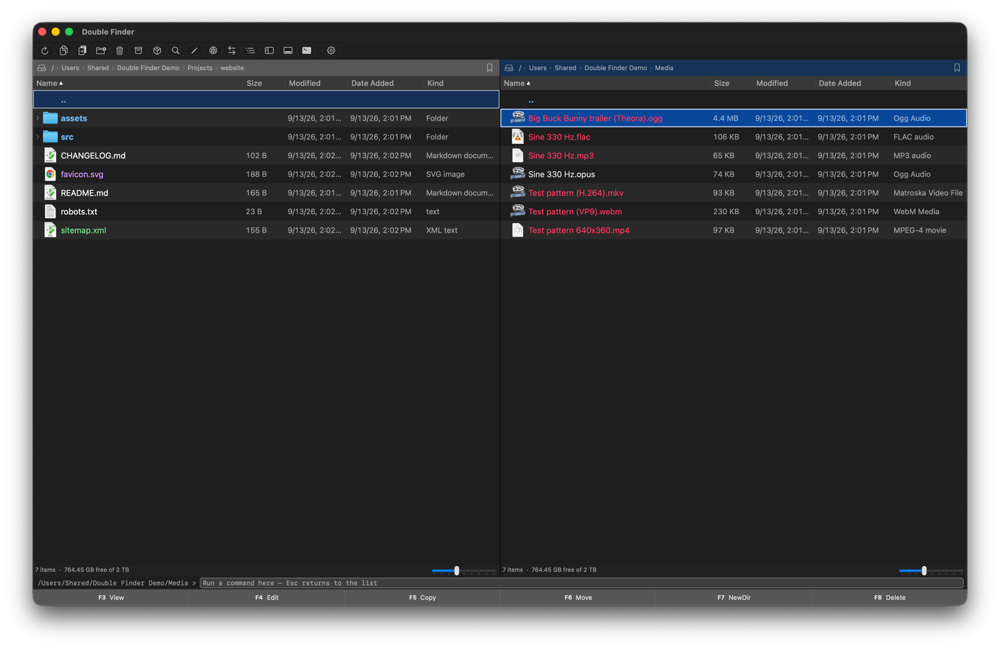
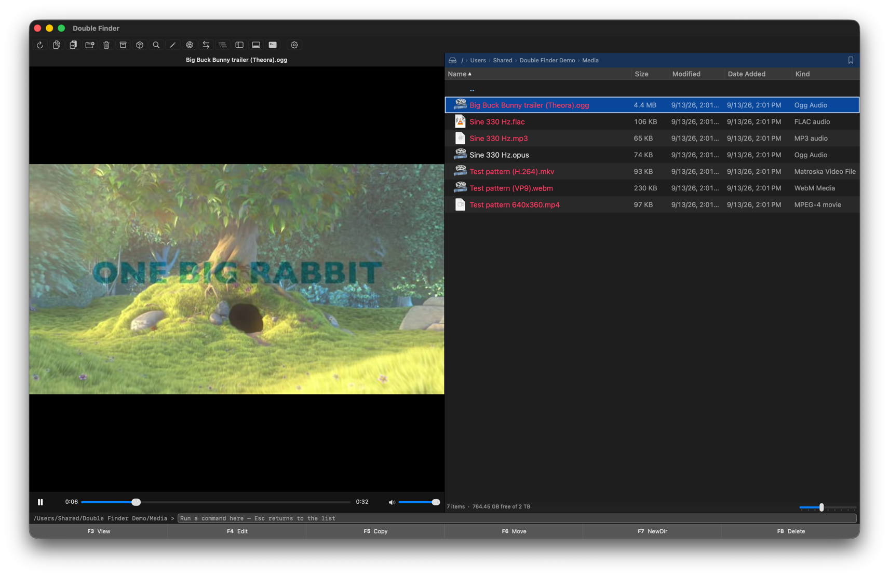
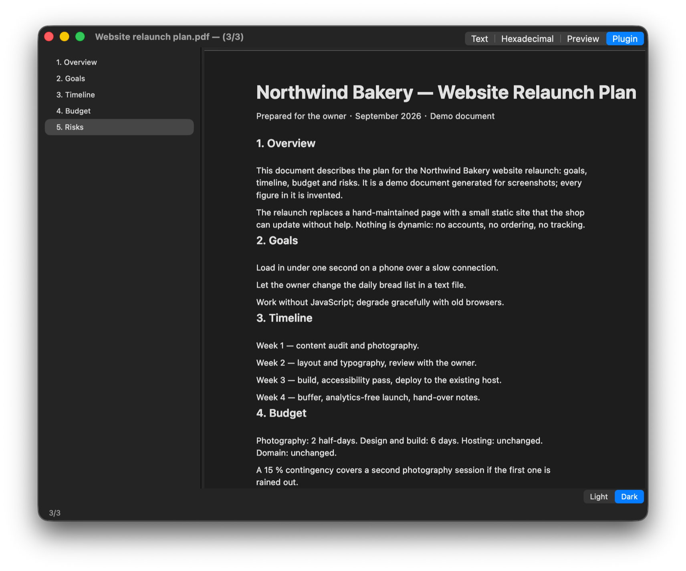

# Double Finder

A native **dual-pane file manager for macOS**, written in pure AppKit (no
SwiftUI), inspired by the Total Commander workflow.

> Free and open source. No Electron, no cross-platform toolkit — just a fast,
> native Mac app.



<p align="center">
  
  
</p>

## Features

- **Dual-pane layout** with an active panel, tabs (⌘T / ⌘W), and a directory
  tree sidebar (⌘⇧D).
- **Android phones over USB (MTP):** plug one in, pick it under ⌘K ▸ Android,
  and it appears as a drive — browse, upload, download with byte progress,
  rename, recursively delete, and copy/move *within* the phone without the data
  crossing USB.
- **View modes** (⌘1/2/3): full details, brief, and thumbnails (Quick Look).
- **Built-in viewer (F3):** a Total Commander–style Lister with three modes —
  text, hexadecimal and Quick Look preview (images, PDF, video, audio,
  Office…) — chosen automatically per file and switchable with 1 / 2 / 3.
  Built-in plugins add a fourth mode for PDFs (dark mode, outline sidebar),
  Markdown, EPUB / Kindle books, images with zoom and pan (camera RAW such as
  CR2 / NEF / ARW / DNG included), and video / audio decoded in-process by
  libVLC (MKV, WebM, AVI, WMV, FLV, OGG / Opus, WMA, APE… play like MP4 and
  MP3). The Quick View pane (Ctrl+Q) shows the same.
  Syntax highlighting for 17 languages, Markdown rendered as a page (including
  mermaid / PlantUML diagrams), EPUB and Kindle books (MOBI / AZW / AZW3, no
  DRM) rendered as one page with a table-of-contents sidebar — all built in,
  no external tools — ⌘F search, ⌘= / ⌘- / ⌘0 zoom, and
  ⌘↑ / ⌘↓ to step through the listing; remote and in-archive files are
  fetched on demand.
- **Fast navigation:** drive bar & dropdown, favorites, command-line bar (⌘L
  with Tab completion), Go to Folder (⌘⇧G), in-place folder expansion.
- **Archives (built-in, no external tools):** browse / extract / create zip,
  tar family, 7z, and read-only rar, iso, cpio, xar, and raw gz/bz2/xz/zst via
  libarchive; encrypted zip and 7z, header-encrypted 7z, solid 7z and
  multi-volume (`.001`) sets via a 7-Zip engine compiled into the app (see
  below).
- **Connect to Server (⌘K):** one unified connection window for **SFTP**,
  **S3-compatible object storage**, and **SMB/NAS** — with live Bonjour
  discovery of servers on the local network and a saved address book.
  - **SFTP:** browse remote servers over `ssh`/`scp`, including streaming
    browse of remote archives without downloading the whole file.
  - **S3:** any S3-compatible endpoint (AWS S3, MinIO, Cloudflare R2, Huawei
    OBS, …) via native AWS SigV4 signing — zero external CLI/SDK. Browse
    buckets/objects, concurrent multi-file up/download with a count-based
    progress bar, and folder upload.
  - **SMB:** mount via the system's NetFS with native authentication — no
    Finder window.
- **Edit remote files (F4):** editing an S3/SFTP file downloads a temp copy;
  when Double Finder regains focus and the copy changed, it offers to upload
  it back (Total Commander–style write-back).
- **File operations:** copy/move with a progress sheet and transfer queue,
  **overwrite/skip/cancel conflict prompts** on every backend (local, SFTP,
  S3), in-place rename, batch rename (⌘⇧R), cut/paste, drag & drop, Open With,
  trash (⌘⌫) and permanent delete (F8).
- **Power tools:** quick search (just start typing to filter the list —
  substring match plus Chinese pinyin initials; ⌘F opens the filter bar),
  select by pattern (+/-/*), find files
  (⌘⇧F) incl. content & Spotlight, directory compare & sync, branch view
  (⌘⇧B).
- **Customizable:** toolbar, keyboard shortcuts, file-type coloring, icon
  size, visible columns — all in a unified Settings window (⌘,).

## Requirements

- macOS 13 (Ventura) or later
- Apple Silicon or Intel
- `brew install libmtp` — required to **build** (the Android/MTP backend links
  it). The packaged `.app` bundles the library, so end users need nothing.
- `Tools/fetch-vlckit.sh` — optional for a **build**: downloads the VLCKit
  framework (libVLC, LGPL-2.1, 88 MB) that gives the media player its decoders.
  `package_app.sh` fetches it on its own; without it the project still builds
  and the player covers only the formats macOS decodes. End users need nothing.

## Install

### Download a build

Every push to `main` refreshes the [`latest`](../../releases/tag/latest)
prerelease; tagged versions get their own release. Each publishes **two DMGs**
— pick the one matching your Mac:

| Download | For |
|---|---|
| `Double-Finder-arm64.dmg` | Apple Silicon (M1 and later) |
| `Double-Finder-x86_64.dmg` | Intel Macs |

They are separate rather than universal for the reason described under
[Package a distributable `.app`](#package-a-distributable-app).

### Build from source

```bash
swift build -c release
"$(swift build -c release --show-bin-path)/Double Finder"
```

### Package a distributable `.app`

```bash
./package_app.sh        # → ./.dist/Double Finder.app
```

This builds for **the architecture of the machine you run it on** (arm64 on
Apple Silicon, x86_64 on Intel), draws the icon, bundles `libmtp`/`libusb` and
the VLCKit framework (fetched on demand, thinned to that architecture), and
ad-hoc code-signs the bundle. It is no
longer universal: Homebrew ships a single arm64 bottle for libmtp and builds
every other platform from source, so both halves of a universal dylib can't be
obtained on one machine.

> **Gatekeeper note:** the app is **ad-hoc signed**, not notarized by Apple. On
> first launch macOS says it "could not verify" the app or that it is
> "damaged" and refuses to open it. Since macOS 15 (Sequoia) the old
> right-click ▸ Open trick no longer works for unnotarized apps; instead, after
> that first refusal, open **System Settings ▸ Privacy & Security**, scroll to
> the Security section and click **Open Anyway** next to Double Finder, then
> confirm. On macOS 13 and 14, right-click the app ▸ **Open** still works.
> Alternatively, clear the quarantine flag once and the app opens normally:
>
> ```bash
> xattr -dr com.apple.quarantine "/Applications/Double Finder.app"
> ```

## Archive engines

Archives run through the system `libarchive` — **except** what it cannot do:
decrypt `.7z`, or write encrypted / multi-volume `.7z`. For those Double Finder
compiles in the 7z handler from the official 7-Zip sources
(`Sources/CSevenZip`, LGPL-2.1) and calls it in-process. Nothing is downloaded
at package time and nothing needs to be installed; the bare dev binary and the
packaged `.app` behave the same. See `THIRD-PARTY.md` for licensing.

## Plugins

Double Finder has a Total Commander-style plugin API (`PluginKit/`, module
`DoubleFinderPluginKit`): **file-system plugins** add a drive to the drive bar
(like TC's WFX), **viewer plugins** add a Lister mode for a file type (WLX) —
either a custom view or an HTML page shown in the Lister; the Markdown preview,
the ebook reader, the PDF viewer and the media player are built-in plugins of
this kind and can be switched off —,
**packer plugins** make a new archive format browsable and extractable (WCX,
read-only), **content plugins** add columns to the file list (WDX), and
**command plugins** add an entry to the Plugins menu, the toolbar and the
shortcut editor. A plugin is a `.dfplugin`
bundle dropped into `~/Library/Application Support/Double Finder/Plugins`;
manage them in Settings ▸ Plugins.

To write one, read the [plugin development guide](docs/plugin-development.md)
([中文](docs/plugin-development.zh-Hans.md)), scaffold a package with
`Tools/new-plugin.sh MyPlugin com.example.myplugin`, and build it with the
generated `build.sh --install`. Every release ships the SDK as
`DoubleFinderPluginKit-SDK-<version>.zip` (the `PluginKit` package, template,
scaffolder, guide and sample) for plugin authors who don't want the whole
source tree; `./package_sdk.sh` builds the same zip locally. `Examples/SamplePlugin` is
a complete plugin implementing every extension point.

## Building & architecture

Pure AppKit: `NSApplication` → `AppDelegate` → `MainWindowController` →
`MainViewController`. State is reactive via `PanelState.onChange` callbacks
(not Combine). There are no unit tests yet for the AppKit layer; pure-logic
units live under `Tests/`.

## Support the project

Double Finder is free, open source and built in my spare time. If it saves you
time, a small donation is welcome — it goes toward the **Apple Developer
Program** membership (so releases can be notarized and open without Gatekeeper
warnings), the **Claude Code** subscription used to develop it, and the
occasional **coffee**. Donating is entirely optional: it buys no features, no
support priority and no say over the roadmap — starring the repo or reporting a
bug helps just as much.

[](https://paypal.me/qianwch)

| PayPal | WeChat Pay (微信) | Alipay (支付宝) |
|:-:|:-:|:-:|
| <a href="https://paypal.me/qianwch"></a> |  |  |

## Contributing

Issues and pull requests are welcome. Please:

1. Keep changes focused and match the surrounding code style.
2. Run `swift build` and `swift test` before submitting.
3. Describe the user-visible behavior change in the PR.

## License

Apache License 2.0 — see [`LICENSE`](LICENSE) and [`NOTICE`](NOTICE).
Third-party components and attributions: [`THIRD-PARTY.md`](THIRD-PARTY.md).

Double Finder is inspired by Total Commander's workflow but contains none of its
code, name, or assets and is not affiliated with it. "Finder" is a trademark of
Apple Inc.; this project is independent and not affiliated with Apple.
